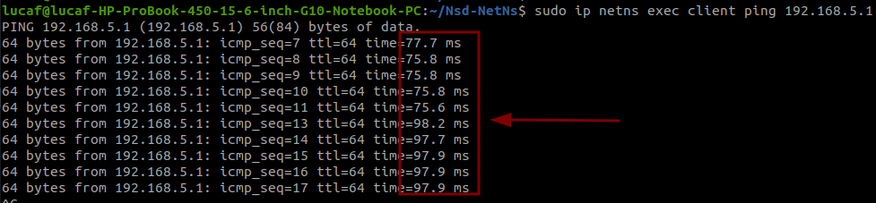
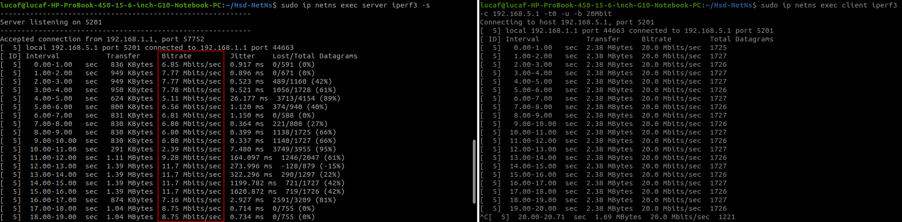
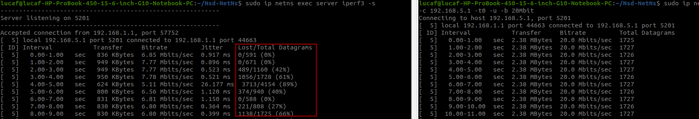
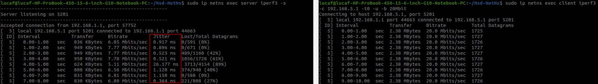

# Execution

## How to download code
To download the code, inside your pc run the following command:
```
git clone https://github.com/lucaFiscariello/Nsd-NetNs/
scp -r Nsd-NetNs ubuntu@ip-vm:/home/ubuntu
```

## Make scripts executable
Inside **the virtual machine** execute:
```
cd Nsd-NetNs
chmod +x buildNet
chmod +x cleanNet
chmod +x emulation_best_link_quality.sh
chmod +x emulation_best_latency.sh
chmod +x emulation_shortest_hop.sh
chmod +x ovs-ns/createBr.sh
chmod +x ovs-ns/createBr.sh
chmod +x ovs-ns/startOvs.sh
chmod +x ovs-ns/startOvsDb.sh
```

## Prerequisites
Inside **the virtual machine** execute:
```
sudo apt install iperf3
sudo apt install openvswitch-switch 
```

## How to build network
The following command creates a network of 11 namespaces.
```
cd Nsd-NetNs
./buildNet
```

Specifically, a network consisting of a client, a server and 9 routers is created. The routers are organized in a mesh topology consisting of 3 columns and 3 rows.
You can check what name spaces are created by the *./buildNet* script with the following command:
```
sudo ip netns show
```

To view connections between routers you can go into each namespace and see what other namespaces it can talk to. To do this you can run the following command:
```
#You can use also R2 or R3 or ..R9
sudo ip netns exec R1 ip a  
```

The output of the command *"sudo ip netns exec R1 ip a"* shows how many interfaces the namespaces has. Each interface has the name "Rx-Ry." The interface name lets you know which namespaces are connected to each other. For example, if an interface is named "R1-R2" it means that the namespaces R1 and R2 are connected to each other. 
Note well that not all routers talk to all routers. The routers in each column can only talk to the "bottom" and "top" router and all the routers in the next column.

## How to Test "Best link quality algorithm"
```
./emulation_best_link_quality.sh
```

To test the ping you can run:
```
sudo ip netns exec client ping 192.168.5.1
```

While ping is running, to check if the traffic passing through a namespaces, you can run the following command from **another terminal**: 
```
#You can use also R2 or R3 or ..R9
sudo ip netns exec R1 tcpdump 
```

## How to Test "Best latency algorithm"
> **Warning**
>
> Stop the execution of *emulation_best_link_quality.sh*  script.

Clean the environment and then run the new emulation script:    
```
./cleanNet
./buildNet
./emulation_best_latency.sh
```
To test the ping you can run:
```
sudo ip netns exec client ping 192.168.5.1
```

To study the routing algoritm you can execute the following command from two new terminals:
```
#inside one new terminal
sudo ip netns exec server iperf3 -s 
```

```
#inside another terminal
sudo ip netns exec client iperf3 -c 192.168.5.1 -t0 -u -b 20Mbit
```

## How to Test "Shortest Hop algorithm"
> **Warning**
>
> Stop the execution of other scripts.

Clean the environment and then run the new emulation script:    
```
./cleanNet
./buildNet
./emulation_shortest_hop.sh
```
To test the ping you can run:
```
sudo ip netns exec client ping 192.168.5.1
```

To study the routing algoritm you can execute the following command from two new terminals:
```
#inside one new terminal
sudo ip netns exec server iperf3 -s 
```

```
#inside another terminal
sudo ip netns exec client iperf3 -c 192.168.5.1 -t0 -u -b 20Mbit
```

## Clean All

```
./cleanNet.sh
```

# Measurament
> **Warning**
> 
> Perform measurements for each algorithm

## Latency
How to measure latency ?
1. Start one of the three algorithm. (Remember to clean the environment first)
2. Execute ping 
3. Read the latency from the ping
4. Creates a chart where the x-axis is time and the y-axis is latency expressed in milliseconds

For example the image below shows the output of ping command. The red rettangle contains the latency values that have to be insterted in the chart. 



## Bandwidth
How to measure bandwidth ?
1. Start one of the three algorithm. (Remember to clean the environment first)
2. Execute the iperf3 (both client and server as shown above)
3. Read the bandwidth from the output of iperf3 command
4. Creates a chart where the x-axis is time and the y-axis is the bandwidth expressed in Mbit/s

For example the image below shows the output of iperf3 command. The red rettangle contains the bandwidth values that have to be insterted in the chart. 




## Loss
How to measure Loss ?
1. Start one of the three algorithm. (Remember to clean the environment first)
2. Execute the iperf3 (both client and server as shown above)
3. Read the loss from the output of iperf3 command
4. Create a chart where the x-axis is time and the y-axis is the loss

For example the image below shows the output of iperf3 command. The red rettangle contains the loss values that have to be insterted in the chart. 



## Jitter
How to measure Jitter ?
1. Start one of the three algorithm. (Remember to clean the environment first)
2. Execute the iperf3 (both client and server as shown above)
3. Read the jitter from the output of iperf3 command
4. Create a chart where the x-axis is time and the y-axis is the jitter

For example the image below shows the output of iperf3 command. The red rettangle contains the jitter values that have to be insterted in the chart. 

